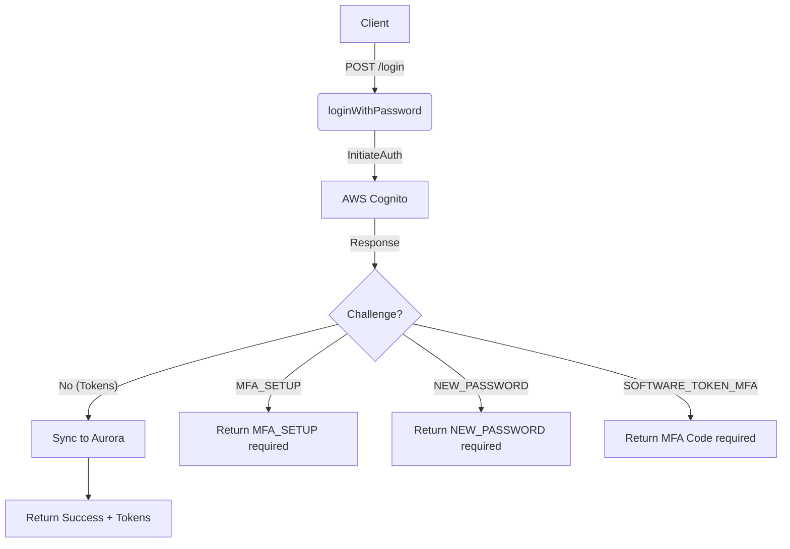
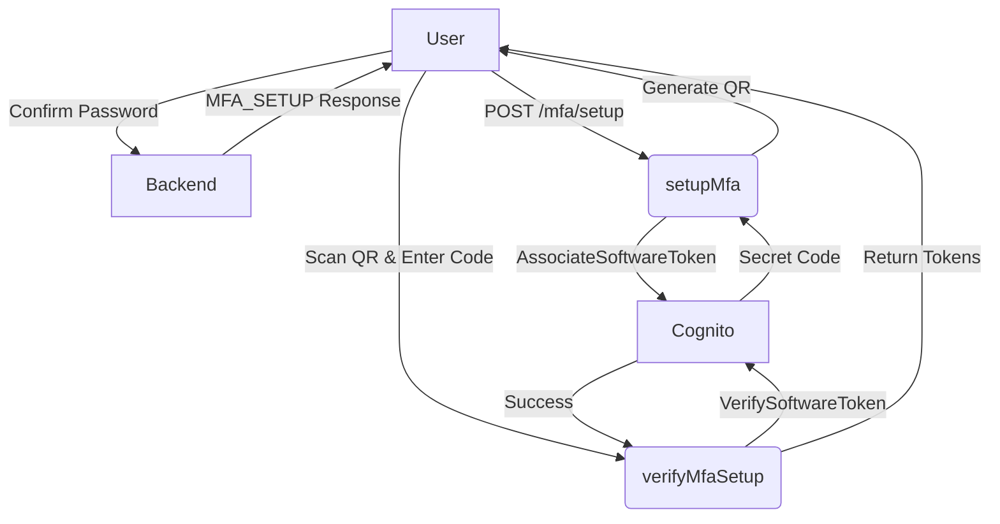

# Documentation: `services/cognito.auth.service.js`

## 📋 Overview

**Purpose**: Handles all AWS Cognito interactions for authentication and user management. This service acts as the bridge between the application and the AWS Identity Provider.

**Location**: `backend/services/cognito.auth.service.js`

**Dependencies**:
- `@aws-sdk/client-cognito-identity-provider`: AWS SDK v3 for Cognito interactions.
- `qrcode`: Generates QR codes for MFA setup.
- `user-sync.service.js`: Synchronizes authenticated users into the local Aurora database.

---

## 🎯 What This File Does

This service authenticates users and manages their lifecycle in AWS Cognito. It implements a smart routing mechanism for authentication challenges (MFA, new password) and ensures that login events propagate user data to the database.

Key responsibilities:
1.  **Login Flow**: Orchestrates the entire login process, handling various Cognito challenges.
2.  **MFA Management**: Setup, verification, and challenge response for TOTP (authenticator app) MFA.
3.  **User Management**: Admin-level creation of users in Cognito.
4.  **Data Synchronization**: Triggers sync to Aurora on successful login or via bulk sync operations.

---

## 🔧 Workflow & Diagrams

### Login Flow (Route: `/api/auth/login`)



### MFA Setup Flow



---

## 🔧 Functions

### 1. `loginWithPassword(req, res)`

**Purpose**: The primary entry point for user authentication.

**Parameters**:
- `req.body.username`: The user's identifier (email or username).
- `req.body.password`: User's password.
- `req.body.userType`: `'client'` (default) or `'internal'`. Determines which User Pool App Client ID to use.

**Logic**:
1.  Selects the correct `ClientId` based on `userType`.
2.  Sends `InitiateAuth` command with `USER_PASSWORD_AUTH` flow.
3.  **Handlers**:
    *   **Success**: Parses tokens, triggers `syncCognitoUserToAurora`, and returns user session.
    *   **NEW_PASSWORD_REQUIRED**: Returns session + status indicating new password is needed.
    *   **MFA_SETUP**: User needs to configure TOTP. Returns session.
    *   **SOFTWARE_TOKEN_MFA**: User needs to input their TOTP code. Returns session.

**Example Response (Success)**:
```json
{
  "success": true,
  "status": "SUCCESS",
  "tokens": {
    "idToken": "eyJ...",
    "accessToken": "eyJ...",
    "refreshToken": "eyJ..."
  },
  "user": { ... },
  "auroraUser": { ... }
}
```

---

### 2. `setupMfa(req, res)`

**Purpose**: Initiates the device registration process for MFA.

**Parameters**:
- `req.body.session`: The Cognito session string returned from a previous step (e.g., login or password change).
- `req.body.username`: Username.

**Behavior**:
1.  Calls `AssociateSoftwareTokenCommand`.
2.  Receives a secret key from Cognito.
3.  Generates a QR Code Data URL (`data:image/png;base64,...`) using user detail and secret.
4.  Returns the Secret Code (for manual entry) and QR Code (for scanning).

---

### 3. `verifyMfaSetup(req, res)`

**Purpose**: Finalizes MFA setup by verifying the first code generated by the user's device.

**Parameters**:
- `req.body.code`: The 6-digit TOTP code.
- `req.body.session`: The current session string.

**Behavior**:
1.  Calls `VerifySoftwareTokenCommand`.
2.  If successful, the user is now enrolled.
3.  **Critical**: If Cognito returns a valid session or tokens immediately, the response includes them, logging the user in directly if possible.

---

### 4. `verifyMfaChallenge(req, res)`

**Purpose**: Handles the `SOFTWARE_TOKEN_MFA` challenge during standard login.

**Parameters**:
- `req.body.code`: The 6-digit TOTP code.
- `req.body.session`: The session string from the login step.

**Logic**:
1.  Calls `RespondToAuthChallengeCommand` with `SOFTWARE_TOKEN_MFA` challenge name.
2.  On success, parses tokens and performs the **Aurora Sync**.
3.  Returns final authentication result.

---

### 5. `changePassword(req, res)`

**Purpose**: Handles the `NEW_PASSWORD_REQUIRED` challenge.

**Parameters**:
- `req.body.newPassword`: The desired password.
- `req.body.session`: Session string.

**Logic**:
1.  Calls `RespondToAuthChallengeCommand` with `NEW_PASSWORD_REQUIRED`.
2.  **Transition Handling**:
    *   If response is `AuthenticationResult` (Tokens): User is logged in.
    *   If response is `MFA_SETUP`: User must now set up MFA.

---

### 6. `adminCreateUser(userData)`

**Purpose**: Creates a new user in the Cognito User Pool (Admin action).

**Parameters**:
- `userData`: Object containing `username`, `email`, `name`, `role`, `userType`, `temporaryPassword`.

**Process**:
1.  Validates `COGNITO_USER_POOL_ID`.
2.  Calls `AdminCreateUserCommand`:
    *   Sets `email_verified = true`.
    *   Sets temporary password.
    *   Suppresses the default welcome email (`MessageAction: 'SUPPRESS'`) to handle it via custom logic if needed.
3.  **Group Assignment**:
    *   Maps application role (e.g., `super_admin`) to Cognito Group (e.g., `Admins`).
    *   Calls `AdminAddUserToGroupCommand`.

---

### 7. `syncAllUsersFromCognito()`

**Purpose**: A "Deep Sync" utility to pull ALL users from Cognito into Aurora. Ideally used for migrations or repairing consistent data drift.

**Logic**:
1.  Iterates through Cognito users using `ListUsersCommand` (pagination supported).
2.  **N+1 Solution**: For *each* user, it makes a separate `AdminListGroupsForUserCommand` call because standard list doesn't return groups.
3.  Constructs a payload simulating an ID Token.
4.  Calls `syncCognitoUserToAurora`.

**Returns**: Statistics object `{ synced, failed, total }`.

---

## 🚨 Common Issues & Troubleshooting

### Issue 1: "Session does not exist" or "Invalid Session"
**Cause**: Cognito sessions expire quickly (typically 3 minutes).
**Solution**: The user must restart the login flow from step 1.

### Issue 2: MFA Code Mismatch
**Cause**: Time drift on server or client device.
**Solution**: Ensure server time is synced via NTP. Advise user to check their phone's time settings.

### Issue 3: "NotAuthorizedException: Incorrect username or password"
**Cause**: Standard auth failure, or the user is in a state (`CONFIRMED` vs `RESET_REQUIRED`) that prevents standard login.

### Issue 4: Sync Failures
**Log**: `⚠️ Aurora sync failed (non-blocking)`
**Cause**: Database connection issues or validation errors (e.g., duplicate unique keys).
**Impact**: User can still log in, but local DB data might be stale.

## 📝 Best Practices Used
1.  **Dual App Client Support**: Handles `internal` vs `client` app clients dynamically.
2.  **Graceful Degredation**: Login succeeds even if Aurora sync fails (non-blocking sync).
3.  **Secure Flow**: Uses `USER_PASSWORD_AUTH` which is standard for server-side auth (SRP would be client-side).
4.  **Env Validation**: Checks for Client IDs and User Pool IDs before crucial operations.
