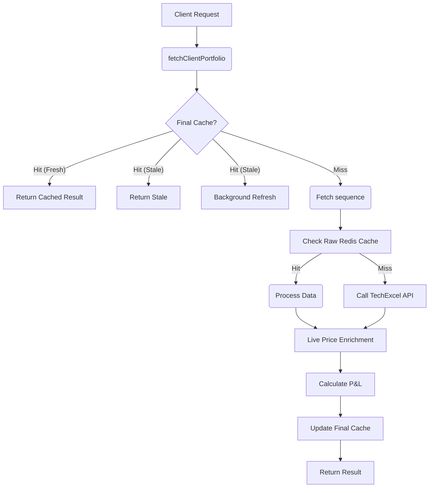

# Documentation: `services/techexcel.service.js`

## 📋 Overview

**Purpose**: Integrates with the TechExcel external back-office API to fetch Portfolio Holdings and Ledger (Account Statement) data. This service handles data transformation, deduplication, live price enrichment, and implements a sophisticated caching strategy.

**Location**: `backend/services/techexcel.service.js`

**Dependencies**:
- `axios` - External API requests.
- `kambala.service.js` - Real-time market prices.
- `redis.service.js` - Caching layer.
- `scrip-search.service.js` - Symbol-to-Token resolution.

---

## 🎯 What This File Does

1.  **TechExcel Authentication**: Manages login and token lifecycle for the TechExcel API.
2.  **Portfolio Fetching**:
    *   Fetches raw holdings.
    *   **Enriches** with live market prices (via Kambala).
    *   **Calculates** Portfolio P&L and net worth.
    *   **Caches** results using a Stale-While-Revalidate pattern.
3.  **Ledger Fetching**:
    *   Fetches account transactions.
    *   Calculates running balances.
    *   Consolidates duplicates (e.g., split Opening Balances).
4.  **Optimization**:
    *   Parallel execution of Ledger and Portfolio fetches.
    *   Request deduplication (prevents "thundering herd" on the external API).

---

## 🔧 Workflow & Diagrams

### Portfolio Data Flow

---

## 🔧 Key Functions

### 1. `fetchClientPortfolio(payload)`

**Purpose**: The main entry point for getting portfolio data.

**Parameters**:
- `payload.CLIENT_CODE`: The specific client ID (e.g., `S000216`).
- `payload.bypassCache`: Boolean. If true, forces a fresh API call (User clicked "Refresh").

**Architecture - Stale-While-Revalidate (SWR)**:
1.  **Soft Cache (Level 1)**: Checks `portfolio:final:{code}`.
    *   If age < 10 seconds: Return immediately.
    *   If age > 10 seconds: Return stale data immediately, but trigger background refresh.
2.  **Raw Cache (Level 2)**: Checks `portfolio:{code}`.
    *   If raw API data exists, skips API call and goes straight to processing (Live Price update).
3.  **API Fallback (Level 3)**: Calls TechExcel `holding_new` endpoint.

**Parallel Data Fetching**:
To calculate the total "Net Worth", we need both **Stock Holdings** and **Cash Balance**. The service fetches the *Ledger* in parallel with the *Holdings* to extract the closing cash balance, reducing total latency.

---

### 2. `processPortfolioData(rawData)`

**Purpose**: Transforms raw API mess into clean, frontend-ready JSON.

**Data Transformation Steps**:
1.  **Field Mapping**: Maps `SCRIP_SYMBOL` → `security`, `POAQTY` + `NONPOAQTY` → `qty`.
2.  **Deduplication**: TechExcel returns multiple rows per scrip (e.g., different buy dates). This function reduces them into a single weighted-average row per ISIN/Symbol.
3.  **Live Price Enrichment**:
    *   Extracts distinct symbols (`NSE|RELIANCE`).
    *   Resolves symbols to tokens using `scrip-search.service.js`.
    *   Fetches **LTP** (Last Traded Price) and **Previous Close** from `kambala.service.js`.
    *   If live price unavailable, falls back to static price.
4.  **Calculation**:
    *   `Value = Qty * CMP`
    *   `P&L = (CMP - AvgPrice) * Qty`
    *   `Return = P&L %`

---

### 3. `fetchLedger({ CLIENT_CODE, financialYear })`

**Purpose**: Fetches the account statement.

**Features**:
1.  **Request Deduplication**: Uses `pendingLedgerRequests` to ensure that if multiple components ask for the same ledger simultaneously, only one API call is made.
2.  **Date Handling**: Automatically calculates standard Indian Financial Year (Apr-Mar) logic based on current date.
3.  **Data Cleaning**:
    *   **Voucher Decoding**: Translates codes like `BP` → `Bank Payment`, `JV` → `Journal Voucher`.
    *   **Opening Balance Fix**: TechExcel often splits "Opening Balance" into multiple rows. This service detects them and merges them into a single clean "OP" entry at the top.
4.  **Running Balance**: Iterates through transactions to calculate the running balance (`Old Balance + Credit - Debit`).

---

### 4. `login()` and `getAuthToken()`

**Purpose**: Manages TechExcel session.

**Logic**:
*   Credentials loaded from `.env`.
*   Login returns a token valid for 24 hours.
*   Service caches this token in memory for 23 hours to reuse across requests.

---

## 📊 Caching Strategy

| Cache Key | Content | TTL | Purpose |
|-----------|---------|-----|---------|
| `portfolio:final:{code}` | Fully processed JSON (Holdings + Prices + Cash) | 1 Hour | Immediate response (SWR base) |
| `portfolio:{code}` | Raw API response from TechExcel | 10 Min | fast re-processing with new prices |
| `ledger:{code}:{year}` | Processed Ledger JSON | 1 Hour | Expensive computation avoidance |

**Why this matters**:
fetching Portfolio takes ~3-5 seconds (TechExcel is slow).
*   **With Final Cache**: < 5ms response.
*   **With Raw Cache**: ~200ms (Fetch prices only).

---

## 🚨 Common Issues

### Issue 1: "Client Not Found"
**Log**: `TechExcel Ledger Error: Input_Value_Validation - Client Not Found`
**Cause**: The client code exists in Aurora/Cognito but hasn't been synced to the TechExcel back-office server yet.
**UI**: Frontend shows "Account pending setup".

### Issue 2: "0 Values" in Portfolio
**Cause**: Live prices failed to fetch (Kambala down or Scrip resolution failed).
**Solution**: Service is robust - it calculates value based on available data, using 0 if price is missing, but logs warnings.

### Issue 3: Duplicate Ledger Entries
**Cause**: TechExcel sometimes returns multiple "Opening Balance" rows due to internal accounting splits.
**Fix**: The `executeFetchLedger` function has specific logic to consolidate all `OP` rows into one.

## 📝 Best Practices Used
*   **Parallel Promises**: `Promise.all([ledger, holdings])` cuts latency by ~40%.
*   **Result Deduplication**: In-flight promises (`pendingRequests`) prevent wasted API calls.
*   **Graceful Fallbacks**: If Ledger fails, Portfolio still loads (with 0 cash).
*   **Soft vs Hard TTL**: using SWR ensures users almost never see a loading spinner, while data eventually updates.
