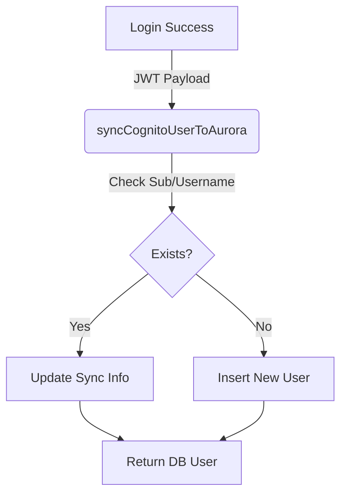

# Documentation: `services/user-sync.service.js`

## 📋 Overview

**Purpose**: Synchronizes user identity from AWs Cognito to the local Aurora SQL database and manages hierarchical relationships. It serves as the "glue" between the authentication provider (Cognito) and the application's authorization database.

**Location**: `backend/services/user-sync.service.js`

**Dependencies**:
- `aurora.service.js` - Database access.

---

## 🎯 What This File Does

1.  **Role Mapping**: Translates Cognito Groups (e.g., "ZonalHeads") into internal database roles (e.g., "zonal_head").
2.  **User Synchronization (`syncCognitoUserToAurora`)**:
    *   Called immediately after every successful login.
    *   Ensures the user exists in `users` table.
    *   Updates `last_login_at` and links the `cognito_sub`.
    *   Handles role updates if Cognito groups change.
3.  **Hierarchy Management**:
    *   Assigns parents to users.
    *   Fetches subordinates using Materialized Path logic (`hierarchy_path`).
    *   Checks access permissions (`canAccessUser`).

---

## 🔧 Role Mapping Logic

The service determines a user's role based on three priorities:

1.  **Cognito Group**: (Highest Priority)
    *   `Admins` / `ADMIN` → `super_admin`
    *   `ZonalHeads` / `ZONAL_HEAD` → `zonal_head`
    *   `BranchManagers` → `branch_manager`
    *   `RMs` / `RM` → `rm`
    *   `Clients` → `client`
2.  **Custom Attribute**: `custom:role` in the JWT token.
3.  **User Type**: Defaults to `rm` for internal pool, `client` for client pool.

**Function**: `getRoleFromCognitoPayload(payload, userType)`

---

## 🔧 Key Functions

### 1. `syncCognitoUserToAurora(cognitoPayload, userType)`

**Purpose**: Idempotent synchronization of a user record.

**Flow**:
1.  **Lookup**: Tries to find user by `cognito_sub`.
2.  **Fallback**: If not found, tries to find by `client_id` (username match).
3.  **Update (if exists)**:
    *   Updates `last_login_at`.
    *   Links `cognito_sub` if it was missing.
    *   *Note*: Logs role mismatches but effectively preserves DB role unless configured otherwise.
4.  **Insert (if new)**:
    *   Creates new user with `status='active'`.
    *   Initializes `hierarchy_path='/'`.

**Returns**: The synchronised Aurora user record.

---

### 2. `assignUserToParent(userId, parentId, assignedBy)`

**Purpose**: Updates a user's `parent_id`.

**Process**:
1.  Validates the parent exists.
2.  Executes `UPDATE users SET parent_id = ...`.
3.  **Side Effect**: The database trigger `trg_update_hierarchy_path` (defined in SQL schema) automatically recalculates the `hierarchy_path` based on the new parent.
4.  **Audit**: Inserts a record into `activity_logs`.

---

### 3. `getSubordinates(userId, includeNested)`

**Purpose**: Retrieves users reporting to a specific user.

**Logic**:
*   **Direct Subordinates** (`includeNested = false`):
    ```sql
    SELECT * FROM users WHERE parent_id = $userId
    ```
*   **All Descendants** (`includeNested = true`):
    *   Fetches current user's `hierarchy_path` (e.g., `/1/5/`).
    *   Queries using prefix match:
    ```sql
    SELECT * FROM users WHERE hierarchy_path LIKE '/1/5/%'
    ```
    *   This is extremely efficient (Materialized Path pattern) compared to recursive CTEs for read operations.

---

### 4. `getAccessibleUsers(userId, role, filters)`

**Purpose**: Returns list of users that the requester is allowed to see/manage.

**Logic**:
*   **Super Admin**: Sees ALL users.
*   **Others**: Sees only their subordinates (via `hierarchy_path LIKE ...`).

**Filters**:
*   Supports filtering by `role`, `status`, `branchId`, `zoneId`.

---

### 5. `bulkImportUsers(users, defaultParentId)`

**Purpose**: Batch insert utility for migrations.

**Behavior**:
*   Iterates through user array.
*   Performs `INSERT ... ON CONFLICT (client_id) UPDATE` (Upsert).
*   Tracks success/failure counts and errors.

---

## 📊 Data Flow Diagram



## 🚨 Common Issues

### Issue 1: Role Mismatch
Warning log: `⚠️ Role mismatch: DB=rm, Cognito=branch_manager`
**Cause**: User promoted in Cognito (added to group) but DB record wasn't manually updated.
**Solution**: The service currently *logs* this but does not override the DB role to prevent accidental privilege escalation. DB is the source of truth for authorization.

### Issue 2: "User not found" during Hierarchy Query
**Cause**: `getSubordinates` called on a user ID that doesn't exist.
**Solution**: Ensure `userId` comes from a verified token (`req.user.id`).

## 📝 Design Patterns
*   **Materialized Path**: Uses `hierarchy_path` string (`/1/4/10`) for O(1) ancestor/descendant lookup complexity, avoiding heavy recursive joins for common reads.
*   **Idempotency**: Sync function can be called infinite times without duplicating data.
*   **Upsert**: Uses PostgreSQL `ON CONFLICT` to handle race conditions during creation.
